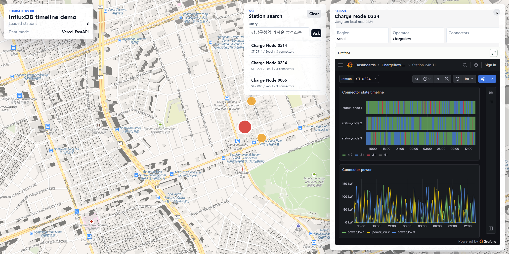
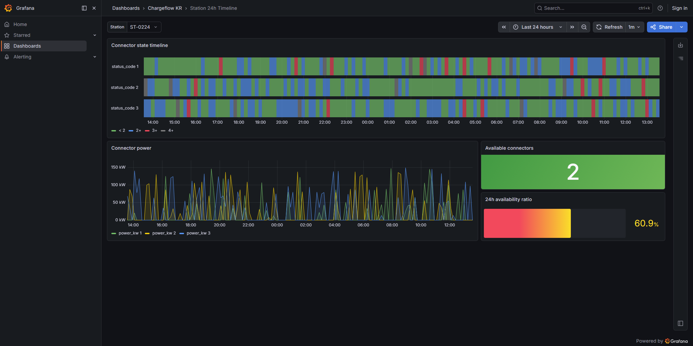
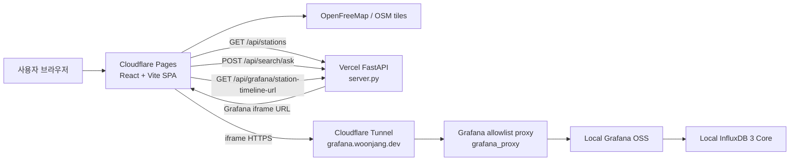
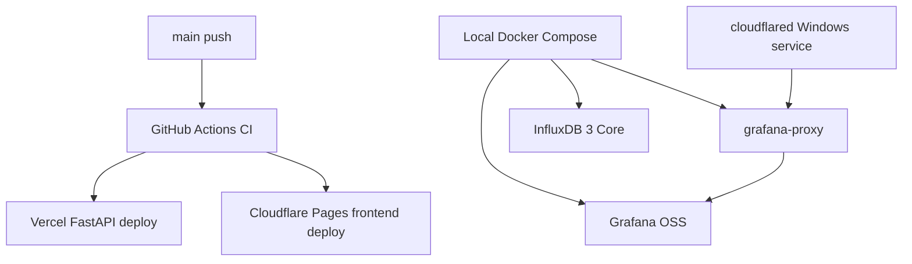

# chargeflow-influxDB

`chargeflow-influxDB`는 ChargeFlow 리팩토링 흐름의 세 번째 단계 프로젝트입니다. `chargeflow-kr`의 한국형 지도 프론트엔드 경험을 유지하면서, 충전소 선택 시 InfluxDB 시계열 데이터를 Grafana iframe으로 보여주는 데모 런타임을 검증합니다.

```text
https://github.com/wkddns40/ev-station
  -> 기존 EV 충전소 대시보드 원형

https://github.com/wkddns40/chargeflow-kr
  -> 한국형 EV 충전소 지도 프론트엔드 중심 리팩토링

https://github.com/wkddns40/chargeflow-influxDB
  -> chargeflow-kr 프론트엔드에 붙일 InfluxDB/Grafana 시각화 데모 런타임
```

[](https://github.com/wkddns40/chargeflow-influxDB/actions/workflows/ci.yml)
[](https://chargeflow-influxdb.pages.dev)
[](https://chargeflow-influxdb.vercel.app/healthz)
[](https://grafana.woonjang.dev/d/station-24h/station-24h?orgId=1&var-station_id=ST-0224&from=now-24h&to=now&kiosk)
[](LICENSE)
[](frontend/tsconfig.json)
[](frontend/vite.config.ts)

## 목차

- [데모 스냅샷](#데모-스냅샷)
- [목표](#목표)
- [기능](#기능)
- [기술 스택](#기술-스택)
- [아키텍처](#아키텍처)
- [로컬 개발](#로컬-개발)
- [스크립트 목록](#스크립트-목록)
- [프로젝트 구조](#프로젝트-구조)
- [배포 기준](#배포-기준)
- [검증](#검증)
- [라이선스](#라이선스)

## 데모 스냅샷

초기 화면은 `chargeflow-kr`의 지도 비율을 유지하고, Ask 검색 결과 3개와 선택 충전소의 Grafana 타임라인 패널을 함께 보여줍니다.

아래 스냅샷은 `ST-0224` 기준으로 Grafana `now-24h` 데이터 윈도우와 InfluxDB seed 시점이 맞는 상태에서 생성했습니다.





현재 데모 프론트엔드는 Cloudflare Pages, API는 Vercel FastAPI로 배포합니다.

- Demo site: [chargeflow-influxdb.pages.dev](https://chargeflow-influxdb.pages.dev)
- API health: [chargeflow-influxdb.vercel.app/healthz](https://chargeflow-influxdb.vercel.app/healthz)
- Station API: `/api/stations?profile=seoul-gyeonggi&limit=700`
- Ask API: `/api/search/ask`
- Grafana URL API: `/api/grafana/station-timeline-url?station_id=ST-0001`
- Grafana dashboard: [grafana.woonjang.dev](https://grafana.woonjang.dev/d/station-24h/station-24h?orgId=1&var-station_id=ST-0224&from=now-24h&to=now&kiosk)

## 목표

```text
chargeflow-kr frontend shell
  -> 한국 EV 충전소 지도
  -> Ask 검색
  -> 마커 선택
  -> 우측 Grafana 중심 상세 패널

chargeflow-influxDB runtime
  -> Vercel FastAPI station API
  -> Grafana iframe URL API
  -> Local InfluxDB 3 Core mock 시계열
  -> Grafana allowlist proxy
  -> Local Grafana OSS dashboard
  -> Cloudflare Tunnel HTTPS 노출
```

이 저장소의 핵심은 경로 계획이나 PostGIS 운영 기능이 아니라, 지도 위 충전소 선택과 InfluxDB/Grafana 시각화 연결을 검증하는 것입니다.

## 기능

| | |
|---|---|
| 지도 기반 충전소 표시 | 서울/경기 mock 충전소 데이터를 MapLibre 지도 위에 표시합니다. 초기 데모 화면은 Ask 결과 3개와 선택 충전소 패널을 함께 보여줍니다. |
| Ask station 검색 | `POST /api/search/ask`가 자연어 또는 키워드를 받아 충전소 metadata와 장소 alias 기준으로 최대 3개 후보를 반환합니다. |
| Grafana iframe 패널 | 마커 또는 검색 결과를 선택하면 우측 패널에서 station metadata와 Grafana dashboard iframe을 표시합니다. |
| Station variable 전달 | backend가 `var-station_id=<선택 station>`이 포함된 Grafana URL을 생성합니다. |
| InfluxDB mock 시계열 | InfluxDB 3 Core에 700개 서울/경기 충전소의 7일치 10분 간격 mock 데이터를 적재해 Grafana dashboard에서 조회합니다. 각 충전소는 3개 connector로 통일합니다. Grafana 쿼리는 station별 최신 seed 구간 24시간을 현재 시간축으로 shift해 `now-24h` 0건 재발을 막습니다. |
| 무료 PoC 배포 흐름 | Cloudflare Pages frontend, Vercel FastAPI, 로컬 Grafana/InfluxDB, Grafana allowlist proxy, Cloudflare Tunnel 조합을 기준으로 합니다. |

## 기술 스택

| 레이어 | 도구 |
|---|---|
| 프론트엔드 | React 18, TypeScript strict, Vite 7 |
| 지도 | MapLibre GL, `react-map-gl`, deck.gl `ScatterplotLayer` |
| 데이터 패칭 | TanStack Query, FastAPI JSON client |
| 백엔드 | FastAPI, Python, Vercel Python entrypoint |
| 시계열 DB | InfluxDB 3 Core local self-hosted |
| 시각화 | Grafana OSS dashboard iframe |
| HTTPS 노출 | Cloudflare Tunnel for Grafana allowlist proxy |
| 테스트 | Vitest, pytest, FastAPI TestClient |
| CI | GitHub Actions backend/frontend/mock/compose jobs |

## 아키텍처

### 런타임 데이터 흐름



Vercel FastAPI는 station 목록, Ask 검색, Grafana URL 생성만 담당합니다. InfluxDB는 외부에 직접 공개하지 않고, Cloudflare Tunnel은 `grafana_proxy` allowlist proxy만 노출합니다. proxy는 dashboard/static/query 경로만 Grafana로 전달하고, `/`와 `/login`은 기본 station dashboard로 redirect하며, `/api/login` 등 admin/login API는 차단합니다.

### 배포 흐름



## 로컬 개발

Docker Compose 전체 런타임:

```powershell
docker compose up -d
```

프론트엔드:

```powershell
cd frontend
npm ci
$env:VITE_API_BASE_URL='http://localhost:8000'
npm run dev
```

백엔드만 직접 실행할 경우:

```powershell
cd backend
python -m venv .venv
.venv\Scripts\activate
pip install -r requirements.txt
$env:PYTHONPATH='.'
$env:GRAFANA_BASE_URL='http://localhost:3002'
uvicorn app.main:app --reload
```

## 스크립트 목록

| 명령 | 효과 |
|---|---|
| `python -m pytest backend/tests` | 백엔드 API와 mock 생성 테스트를 실행합니다. |
| `cd frontend && npm run typecheck` | TypeScript 프로젝트 검사를 실행합니다. |
| `cd frontend && npm test` | Vitest 프론트엔드 테스트를 실행합니다. |
| `cd frontend && npm run build` | Vite production build를 생성합니다. |
| `python tools/mockgen.py all --profile smoke --seed 42 --end 2026-01-01T00:00:00Z` | smoke profile mock station/time-series 데이터를 생성합니다. |
| `powershell scripts/verify-local.ps1` | 로컬 패키지 smoke 검증을 실행합니다. |

## 프로젝트 구조

```text
chargeflow-influxDB/
├── frontend/
│   ├── src/
│   │   ├── components/map/       # MapLibre/deck.gl 지도 셸
│   │   ├── components/search/    # Ask 검색 패널
│   │   ├── components/station/   # Grafana iframe 패널
│   │   ├── hooks/                # station/Grafana URL hooks
│   │   ├── lib/                  # API, geo, Grafana helpers
│   │   └── types.ts              # station domain types
│   └── package.json
├── backend/
│   ├── app/
│   │   ├── api/                  # health, stations, search, grafana endpoints
│   │   ├── core/                 # runtime settings
│   │   └── influx/               # InfluxDB client helper
│   ├── data/generated/           # generated station fixture
│   └── tests/                    # pytest suite
├── grafana/
│   ├── dashboards/               # station_24h dashboard JSON
│   └── provisioning/             # datasource/dashboard provisioning
├── grafana_proxy/                 # public tunnel allowlist proxy
├── tools/                        # mock generation and InfluxDB seed scripts
├── scripts/                      # local verification helpers
├── cloudflare/tunnel/            # tunnel config example
├── data/                         # local persisted InfluxDB/Grafana data
├── docs/                         # supporting docs
├── docker-compose.yml            # local InfluxDB/Grafana/proxy/backend/frontend
├── server.py                     # Vercel FastAPI entrypoint
└── vercel.json                   # Vercel API rewrite
```

## 배포 기준

- Cloudflare Pages는 frontend SPA를 배포합니다.
- Vercel Hobby는 FastAPI backend를 배포합니다.
- Grafana OSS와 InfluxDB 3 Core는 로컬 Docker Compose로 자가호스팅합니다.
- Cloudflare Tunnel은 `grafana_proxy` HTTPS origin만 제공합니다. Grafana admin/login API는 public tunnel에서 차단합니다.
- InfluxDB는 외부 인터넷에 직접 공개하지 않습니다.
- Vercel backend가 InfluxDB를 직접 query하지 않고, Grafana URL 생성과 station metadata API에 집중합니다.

필수 환경값:

```text
VITE_API_BASE_URL=https://chargeflow-influxdb.vercel.app
GRAFANA_BASE_URL=https://grafana.woonjang.dev
GRAFANA_ROOT_URL=https://grafana.woonjang.dev
```

## 검증

Backend:

```powershell
python -m pytest backend/tests
```

Frontend:

```powershell
cd frontend
npm run typecheck
npm test
npm run build
```

Runtime smoke:

```text
1. 프론트엔드 접속
2. Ask 검색 결과 3개 표시 확인
3. 충전소 마커 또는 검색 결과 선택
4. 우측 Grafana 패널 로드 확인
5. DevTools에서 iframe `src` 또는 `/api/grafana/station-timeline-url` 응답에 `var-station_id=<선택 station>` 포함 확인
6. Grafana panel에 no data가 없는지 확인
7. iframe fullscreen 진입/복귀 확인
```

## 라이선스

MIT — [`LICENSE`](LICENSE)를 참조해 주세요.
