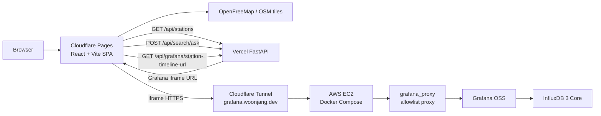

# chargeflow-influxDB

`chargeflow-influxDB`는 ChargeFlow EV 충전소 지도에서 선택한 충전소의 InfluxDB 시계열 데이터를 Grafana iframe으로 보여주는 `deployed demo for InfluxDB + Grafana timeline` 프로젝트입니다.

```text
https://github.com/wkddns40/ev-station
  -> 기존 EV 충전소 대시보드 원형

https://github.com/wkddns40/chargeflow-kr
  -> 한국형 EV 충전소 지도 프론트엔드

https://github.com/wkddns40/chargeflow-influxDB
  -> deployed demo for InfluxDB + Grafana timeline
```

[](https://github.com/wkddns40/chargeflow-influxDB/actions/workflows/ci.yml)
[](https://chargeflow-influxdb.pages.dev)
[](https://chargeflow-influxdb.vercel.app/healthz)
[](https://grafana.woonjang.dev/d/station-24h/station-24h?orgId=1&var-station_id=ST-0224&from=now-24h&to=now&kiosk)
[](LICENSE)
[](frontend/tsconfig.json)
[](frontend/vite.config.ts)

## 데모

- Demo site: [chargeflow-influxdb.pages.dev](https://chargeflow-influxdb.pages.dev)
- API health: [chargeflow-influxdb.vercel.app/healthz](https://chargeflow-influxdb.vercel.app/healthz)
- Station API: `https://chargeflow-influxdb.vercel.app/api/stations?profile=seoul-gyeonggi&limit=700`
- Ask API: `https://chargeflow-influxdb.vercel.app/api/search/ask`
- Grafana URL API: `https://chargeflow-influxdb.vercel.app/api/grafana/station-timeline-url?station_id=ST-0224`
- Grafana dashboard: [grafana.woonjang.dev](https://grafana.woonjang.dev/d/station-24h/station-24h?orgId=1&var-station_id=ST-0224&from=now-24h&to=now&kiosk)

이 README의 기준은 로컬 런타임 검증이 아니라 **배포된 데모 검증**입니다. Cloudflare Pages가 Vercel FastAPI를 호출하고, Grafana iframe은 AWS EC2에서 실행되는 Cloudflare Tunnel origin으로 연결됩니다.


## 목표

이 저장소는 지도 위 충전소 선택, station metadata API, Grafana iframe URL 생성, Grafana OSS, InfluxDB 3 Core 사이의 runtime data flow를 배포 데모로 검증합니다.

프로덕션 충전소 데이터 플랫폼이 아니라, 아래 경로가 실제 공개 URL에서 동작하는지 확인하는 PoC입니다.

```text
Cloudflare Pages React app
  -> Vercel FastAPI station/search/Grafana URL APIs
  -> Cloudflare Tunnel HTTPS origin
  -> AWS EC2 Docker Compose
  -> grafana-proxy allowlist
  -> Grafana OSS station dashboard
  -> InfluxDB 3 Core mock time-series data
```

## 기능

| 영역 | 설명 |
|---|---|
| 지도 기반 충전소 표시 | 서울/경기 mock 충전소 데이터를 `chargeflow-kr`와 같은 지도 UX로 표시합니다. |
| Ask station 검색 | `POST /api/search/ask`가 자연어 또는 키워드를 받아 최대 3개 충전소 후보를 반환합니다. |
| Grafana iframe 패널 | 마커 또는 검색 결과 선택 시 우측 패널에서 station timeline iframe을 표시합니다. |
| Station variable 전달 | backend가 `var-station_id=<선택 station>`이 포함된 Grafana URL을 생성합니다. |
| InfluxDB mock 시계열 | InfluxDB 3 Core에 700개 충전소의 7일치 10분 간격 connector status, charger power, availability 데이터를 저장합니다. |
| Time-shifted Grafana query | Grafana SQL이 최신 seed 구간 24시간을 현재 `now-24h` 범위로 shift해 배포 데모에서 no data가 나오지 않게 합니다. |
| Public tunnel guardrail | 공개 Grafana 경로는 `grafana_proxy` allowlist proxy를 거치며 admin/login/management API를 차단합니다. |

## 기술 스택

| 레이어 | 도구 |
|---|---|
| 프론트엔드 | React 18, TypeScript strict, Vite 7 |
| 지도 | MapLibre GL, `react-map-gl`, deck.gl `ScatterplotLayer` |
| 데이터 패칭 | TanStack Query, FastAPI JSON endpoints |
| API | FastAPI, Python, Vercel Python entrypoint |
| 시계열 DB | InfluxDB 3 Core |
| 시각화 | Grafana OSS dashboard iframe |
| 공개 origin | AWS EC2 Docker Compose + Cloudflare Tunnel |
| edge hosting | Cloudflare Pages frontend, Vercel FastAPI |
| 테스트 | Vitest, pytest, FastAPI TestClient |
| CI | GitHub Actions backend/frontend/mock/compose jobs |

## 아키텍처

### Runtime Data Flow



Vercel FastAPI는 station metadata, Ask 검색, health check, Grafana iframe URL 생성만 담당합니다. 공개 데모 경로에서 Vercel이 InfluxDB를 직접 query하지 않습니다. Grafana가 AWS Docker network 내부에서 InfluxDB를 query합니다.

### AWS 배포 기준

현재 운영 기준은 AWS EC2 위 Docker Compose입니다.

| 항목 | 기준 |
|---|---|
| Compute | AWS EC2 `m7i-flex.large` |
| OS | Ubuntu |
| App path | `/opt/chargeflow-influxdb` |
| Process model | Docker Compose `restart: unless-stopped` |
| Public Grafana origin | 로컬 Windows service가 아니라 AWS `cloudflared` container |
| Public hostname | `grafana.woonjang.dev` |
| App bind address | local service ports는 `127.0.0.1` |
| External access | Cloudflare Tunnel outbound connector만 사용 |
| InfluxDB image | 마이그레이션 데이터와 맞는 `influxdb:3-core` digest 고정 |
| Local tunnel state | AWS가 tunnel을 소유하는 동안 Windows `Cloudflared` service는 `Stopped / Manual` 유지 |

AWS origin은 Grafana와 InfluxDB를 public inbound port로 열지 않습니다. Security Group은 유지보수용 SSH만 허용하고, Grafana/InfluxDB/backend/frontend port는 loopback bind와 tunnel 경로로만 사용합니다.

### Docker 서비스

| Service | 역할 |
|---|---|
| `influxdb3-core` | station timeline 데이터를 file object-store mode로 저장합니다. |
| `grafana` | station 24-hour dashboard와 InfluxDB datasource를 제공합니다. |
| `grafana-proxy` | 공개 tunnel 앞단의 Grafana allowlist proxy입니다. |
| `backend` | 로컬 compose용 station/search/Grafana URL FastAPI입니다. |
| `frontend` | 로컬 compose용 Vite frontend입니다. |
| `cloudflared` | AWS runtime connector입니다. 원격 배포 override에서만 사용합니다. |

## 로컬 개발

Docker Compose 전체 실행:

```powershell
docker compose up -d
```

프론트엔드 직접 실행:

```powershell
cd frontend
npm ci
$env:VITE_API_BASE_URL='http://localhost:8000'
npm run dev
```

백엔드 직접 실행:

```powershell
cd backend
python -m venv .venv
.venv\Scripts\activate
pip install -r requirements.txt
$env:PYTHONPATH='.'
$env:GRAFANA_BASE_URL='http://localhost:3002'
uvicorn app.main:app --reload
```

로컬 URL:

```text
Frontend:      http://localhost:3000
Backend:       http://localhost:8000
Grafana:       http://localhost:3001
Grafana proxy: http://localhost:3002
InfluxDB:      http://localhost:8181
```

## 환경 변수

로컬 기본값은 `.env.example`을 기준으로 합니다.

```text
APP_ENV=local
LOCAL_BIND_ADDRESS=127.0.0.1
FRONTEND_PORT=3000
BACKEND_PORT=8000
GRAFANA_PORT=3001
GRAFANA_PROXY_PORT=3002
INFLUXDB_PORT=8181
CHARGER_DATA_DIR=./data/generated
GRAFANA_ROOT_URL=http://localhost:3001
GRAFANA_BASE_URL=http://localhost:3002
INFLUXDB_DATABASE=charger
VITE_API_BASE_URL=http://localhost:8000
```

배포 기준 값:

```text
VITE_API_BASE_URL=https://chargeflow-influxdb.vercel.app
GRAFANA_BASE_URL=https://grafana.woonjang.dev
GRAFANA_ROOT_URL=https://grafana.woonjang.dev
```

Cloudflare tunnel credential, AWS private key, `.env`, Grafana admin password는 커밋하지 않습니다.

## 검증

### 로컬 검증

```powershell
python -m pytest backend/tests

cd frontend
npm run typecheck
npm test
npm run build
```

검증 helper:

```powershell
powershell scripts/verify-local.ps1
```

Compose config 검증:

```powershell
docker compose config
```

### 배포 데모 검증

```powershell
curl.exe -I https://chargeflow-influxdb.pages.dev/
curl.exe https://chargeflow-influxdb.vercel.app/healthz
curl.exe "https://chargeflow-influxdb.vercel.app/api/grafana/station-timeline-url?station_id=ST-0224"
curl.exe -I "https://grafana.woonjang.dev/d/station-24h/station-24h?orgId=1&var-station_id=ST-0224&from=now-24h&to=now&kiosk"
```

기대 동작:

1. `https://chargeflow-influxdb.pages.dev/`에서 지도 화면이 로드됩니다.
2. 초기 데모 흐름에서 Ask 결과가 표시됩니다.
3. 충전소 선택 시 우측 Grafana iframe이 열립니다.
4. iframe URL에 `var-station_id=<선택 station>`이 포함됩니다.
5. Grafana panel이 no data 없이 표시됩니다.
6. `grafana.woonjang.dev` 전체화면 dashboard가 열립니다.

### AWS origin 검증

유지보수 장비에서:

```powershell
cloudflared tunnel info chargeflow-grafana
```

기대 상태:

- AWS가 tunnel을 소유하는 동안 active connector는 AWS origin 하나여야 합니다.
- 로컬 Windows `Cloudflared` service는 `Stopped / Manual`이어야 합니다.

AWS host에서:

```bash
cd /opt/chargeflow-influxdb
sudo docker compose -f docker-compose.yml -f docker-compose.aws.yml ps
sudo docker compose -f docker-compose.yml -f docker-compose.aws.yml logs --tail=80 cloudflared
sudo docker compose exec -T influxdb3-core influxdb3 query --database charger 'SELECT count(*) AS n FROM connector_status'
sudo docker compose exec -T influxdb3-core influxdb3 query --database charger 'SELECT count(*) AS n FROM charger_power'
sudo docker compose exec -T influxdb3-core influxdb3 query --database charger 'SELECT count(*) AS n FROM availability_rollup'
```

현재 seeded data contract:

| Table | Expected count |
|---|---:|
| `connector_status` | `2,118,900` |
| `charger_power` | `2,118,900` |
| `availability_rollup` | `706,300` |

## AWS 운영

### Tunnel 소유권

`grafana.woonjang.dev`는 한 번에 하나의 production origin만 소유해야 합니다. 로컬 Windows service와 AWS `cloudflared`가 동시에 실행되면 Cloudflare가 요청을 두 origin 중 하나로 보낼 수 있습니다.

AWS 소유 상태 확인:

```powershell
Get-Service Cloudflared
# Expected: Status Stopped, StartType Manual
```

AWS connector 실행:

```bash
cd /opt/chargeflow-influxdb
sudo docker compose -f docker-compose.yml -f docker-compose.aws.yml up -d cloudflared
```

로컬 Windows origin으로 rollback:

```bash
cd /opt/chargeflow-influxdb
sudo docker compose -f docker-compose.yml -f docker-compose.aws.yml stop cloudflared
```

그 다음 관리자 PowerShell에서:

```powershell
Set-Service Cloudflared -StartupType Automatic
Start-Service Cloudflared
```

### 비용 가드레일

AWS는 credit-backed temporary origin입니다. 방치하기 전에 월별 budget alert를 설정합니다.

- `$150`
- `$180`
- `$195`

Budget console:

```text
https://console.aws.amazon.com/cost-management/home#/budgets
```

목표는 credit이 거의 소진된 뒤 대응하는 것이 아니라, credit 소진 전 다음 인프라로 이전하는 것입니다.

## 스크립트

| 명령 | 설명 |
|---|---|
| `python -m pytest backend/tests` | backend API와 mock generation test를 실행합니다. |
| `cd frontend && npm run typecheck` | TypeScript project check를 실행합니다. |
| `cd frontend && npm test` | Vitest frontend test를 실행합니다. |
| `cd frontend && npm run build` | Vite production build를 생성합니다. |
| `python tools/mockgen.py all --profile smoke --seed 42 --end 2026-01-01T00:00:00Z` | smoke mock station/time-series 파일을 생성합니다. |
| `powershell scripts/verify-local.ps1` | local verification bundle을 실행합니다. |

## 프로젝트 구조

```text
chargeflow-influxDB/
|- frontend/
|  |- src/
|  |  |- components/map/       # MapLibre/deck.gl map UI
|  |  |- components/search/    # Ask search panel
|  |  |- components/station/   # Grafana iframe panel
|  |  |- hooks/                # station and Grafana URL hooks
|  |  |- lib/                  # API, geo, Grafana helpers
|  |  `- types.ts              # station domain types
|  `- package.json
|- backend/
|  |- app/
|  |  |- api/                  # health, stations, search, grafana endpoints
|  |  |- core/                 # runtime settings
|  |  `- influx/               # InfluxDB client helper
|  |- data/generated/          # generated station fixture
|  `- tests/                   # pytest suite
|- grafana/
|  |- dashboards/              # station_24h dashboard JSON
|  `- provisioning/            # datasource/dashboard provisioning
|- grafana_proxy/              # public Grafana allowlist proxy
|- tools/                      # mock generation and InfluxDB seed scripts
|- scripts/                    # local verification helpers
|- cloudflare/tunnel/          # tunnel config example, no secrets
|- data/                       # persisted local InfluxDB/Grafana data
|- assets/readme/              # README screenshots
|- docker-compose.yml          # local compose baseline
|- server.py                   # Vercel FastAPI entrypoint
`- vercel.json                 # Vercel API rewrite
```

## 라이선스

MIT. 자세한 내용은 [LICENSE](LICENSE)를 참고합니다.
